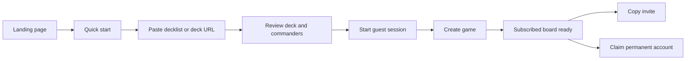
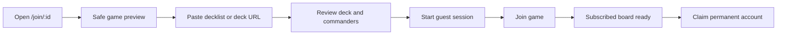
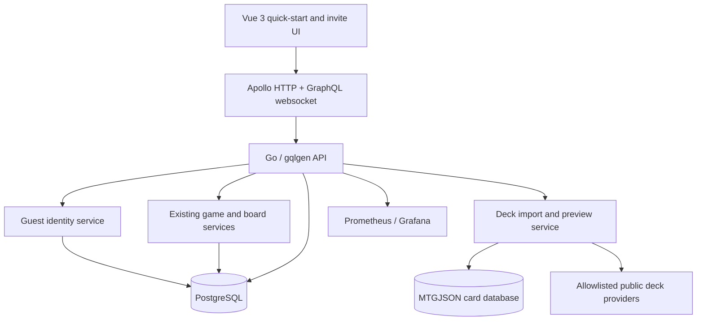

# vEDH Deck-to-Game Activation PRD

**Status:** Draft for implementation
**Owner:** vEDH
**Date:** 2026-07-23
**Code baseline:** `main` at `ef2732a`
**Primary objective:** Deck-to-game activation
**Secondary objective:** User acquisition after activation
**Recommended delivery envelope:** Four weeks for one implementation agent, including stabilization

## 1. Executive Summary

### Problem Statement

vEDH already has working Commander game creation, joining, realtime board state, card interactions, scoring, smoke coverage, browser E2E coverage, and local observability. The path to that value is too long: both hosts and invitees must create an account, manually provide a CSV-formatted decklist, select commanders separately, and navigate several screens before the board is usable.

The current browser E2E test in `app/e2e/create-and-join-game.spec.ts` accurately captures the friction: two users must complete signup before they can create and join a single game. The create and join forms in `app/src/components/games/FormCreateGame.vue` and `app/src/views/JoinGameView.vue` accept only the application's CSV convention, while the backend parser in `server/games.go` assumes CSV rows and can misread unquoted card names containing commas.

### Proposed Solution

Introduce a guest-first quick-start funnel:

1. Paste a normal decklist or a supported public deck URL.
2. Review a parsed deck preview with automatically detected commander candidates.
3. Enter an optional display name.
4. Create or join a game without registering.
5. Reach a subscribed, interactive board.
6. Offer account creation only after the user has received value.

The implementation reuses the existing Vue 3, Pinia, Apollo, Go, gqlgen, PostgreSQL, MTGJSON, Playwright, Prometheus, and Grafana stack. Existing `createGame` and `joinGame` mutations remain the canonical game operations; short-lived guest identities satisfy their authorization requirements.

### Success Criteria

The first beta targets are evaluated after at least 50 host activation starts and 50 invite views:

- **Host activation rate:** At least 60% of users who open quick start reach `board_ready`.
- **Host time to board:** Median at or below 60 seconds and p90 at or below 120 seconds from `quick_start_viewed` to `board_ready`.
- **Invite activation rate:** At least 70% of valid invite viewers reach `player_joined`.
- **Join time to board:** Median at or below 45 seconds and p90 at or below 90 seconds from `invite_viewed` to `board_ready`.
- **Technical success:** At least 98% of valid pasted deck entries resolve to a known card or a clearly identified unresolved entry; create/join request error rate remains below 2%.
- **Post-value acquisition:** At least 15% of activated guest users claim a permanent account within seven days.

### Current-State Findings

- All game, join, board, score, and analysis routes require authentication in `app/src/router/index.ts`.
- Authentication is username/password with a 24-hour JWT stored in browser `localStorage`.
- `CreateGame` and `JoinGame` require authenticated users in `server/games.go`.
- A safe public invite preview does not exist; `getGame` is participant-only.
- The host form contains game name, deck size, and format controls, but its submitted payload does not currently send `Handle` or `FormatID`.
- Deck input is duplicated between create and join views.
- Deck parsing is coupled to game creation and accepts only CSV-shaped input.
- There is no product-funnel event store or acquisition attribution.
- The latest `main` branch adds board/score polish and local Prometheus/Grafana tooling, but does not change these activation constraints.
- The NFT card tracking plan in `docs/plans/2026-07-16-vedh-nft-card-tracking-integration.md` is strategically downstream of activation and must not preempt this work.

## 2. User Experience & Functionality

### User Personas

#### Commander Host / Brewer

Has a deck in Moxfield, Archidekt, or plain text and wants to begin testing immediately. Values speed, deck accuracy, and a shareable table link more than account features.

#### Invited Pod Member

Receives a link from a friend and wants to join with minimal context. Values trust that the link is valid, a clear player/format preview, and not having to create an account before deciding whether vEDH is useful.

#### Activated Guest

Has already reached a board and may want to preserve a display name, game access, and future history. This is the appropriate point to request permanent account credentials.

### Target User Flow

#### Host



#### Invitee



### User Stories and Acceptance Criteria

#### Story A1: Quick-start a game without registering

As a Commander host, I want to load a deck and start a table without creating an account so that I can test vEDH before committing.

Acceptance criteria:

- `/play` is a public route.
- The route accepts pasted deck text and supported public deck URLs.
- A display name is optional; a readable unique guest name is generated when omitted.
- A valid deck preview can create a short-lived guest session and call the existing `createGame` mutation.
- The host is routed directly to `/games/:id`.
- `board_ready` is emitted only after the game query succeeds, the current player's board state is present, and the realtime subscription is connected or has entered a documented degraded state.
- Existing authenticated users can use the same flow without creating a guest identity.

#### Story A2: Import a deck in familiar formats

As a player, I want to paste the decklist I already have so that I do not need to reformat it for vEDH.

Acceptance criteria:

- The canonical parser accepts, at minimum:
  - `1 Sol Ring`
  - `1x Sol Ring`
  - `1,Sol Ring`
  - `1, Sol Ring`
  - quoted CSV such as `1,"Atraxa, Praetors' Voice"`
  - unquoted common text such as `1 Atraxa, Praetors' Voice`
- Blank lines, known section headers, and common sideboard/maybeboard headers are handled deterministically.
- Card names containing commas remain intact.
- The preview shows total cards, detected commanders, unresolved cards, warnings, and blocking errors.
- The preview never silently drops a row.
- The same parser is used for host and join flows.
- At least one public deck-link provider ships in the MVP through an adapter interface. Text paste remains available when a provider is unavailable.

#### Story A3: Join from an invite without registering

As an invited player, I want to understand the table and join it without signup so that accepting an invite feels immediate.

Acceptance criteria:

- `/join/:id` is public.
- A public `gameInvite` query exposes only game ID, format, status, player display names, player count, capacity, and creation time.
- The page clearly reports nonexistent, finished, and full games before asking for a deck.
- A valid guest can use the existing `joinGame` mutation.
- Joining never exposes hidden zones, complete board state, tokens, credentials, or decklists through the public preview.
- The user reaches the board without being redirected through `/login` or `/signup`.

#### Story A4: Share a table immediately

As a host, I want a clear invite control on the board so that I can bring my pod into the game.

Acceptance criteria:

- The board header displays a single primary invite action.
- The action copies `${window.location.origin}/join/${gameID}`.
- Native share is used when available, with copy-to-clipboard as the fallback.
- The UI confirms success and provides a manual-copy fallback on failure.
- `invite_copied` or `invite_shared` records source and game ID without recording clipboard contents.

#### Story A5: Convert a guest after value

As an activated guest, I want to make my identity permanent without losing the game I am playing.

Acceptance criteria:

- Guests see a non-blocking “Save your games” prompt after `board_ready`.
- Claiming an account sets a unique username and password on the same user UUID.
- Current games remain associated with the claimed identity.
- A new full-session token replaces the guest token.
- Username conflicts and password validation errors are recoverable without leaving the board.
- Dismissing the prompt never blocks gameplay.

#### Story A6: Understand funnel performance

As the product owner, I want an authoritative activation funnel so that acquisition work is based on real drop-off data.

Acceptance criteria:

- The application records the event vocabulary defined below.
- Server-side `game_created` and `player_joined` events are authoritative.
- Client-side view/start/readiness events include a random session ID and optional campaign attribution.
- No deck contents, deck URLs, passwords, JWTs, IP addresses, or card-level game state are stored in product-event payloads.
- Product events can be queried by day, role, source, and outcome.
- Prometheus exposes technical counters and latency histograms; PostgreSQL remains the source for user-funnel analysis.

#### Story A7: Recover from expected failures

As a new player, I want clear recovery paths when an import or realtime connection fails so that I can still reach a game.

Acceptance criteria:

- Provider failures offer paste-text fallback without clearing the display name or game context.
- Unresolved cards can be corrected inline before create/join.
- Create/join errors preserve the parsed deck.
- A failed realtime subscription shows a reconnect action and continues read-only polling when practical.
- Error messages use product language and do not expose raw GraphQL, SQL, or provider responses.

### Product Event Vocabulary

| Event | Source | Required fields |
|---|---|---|
| `landing_primary_cta` | Client | session ID, campaign source |
| `quick_start_viewed` | Client | session ID |
| `deck_import_started` | Client | session ID, source type |
| `deck_import_succeeded` | Server | session ID, source type, duration, card count, unresolved count |
| `deck_import_failed` | Server | session ID, source type, normalized reason |
| `guest_session_created` | Server | session ID |
| `game_create_started` | Client | session ID |
| `game_created` | Server | session ID, game ID, user role |
| `invite_copied` | Client | session ID, game ID |
| `invite_viewed` | Client | session ID, game ID, campaign source |
| `join_started` | Client | session ID, game ID |
| `player_joined` | Server | session ID, game ID |
| `board_ready` | Client | session ID, game ID, user role, elapsed milliseconds |
| `account_claim_started` | Client | session ID |
| `account_claimed` | Server | session ID |

### Non-Goals

- Full Magic rules enforcement or automatic stack resolution.
- Broad public matchmaking, ranking, moderation, or reputation systems.
- Native mobile applications or a full mobile board redesign.
- Voice/video chat.
- Monetization or premium entitlements.
- More than one required deck-link provider in the MVP.
- Importing private deck URLs that require users to share third-party credentials.
- Moving JWT storage to HttpOnly cookies in this activation release.
- NFT wallet, ownership, minting, or custom-card integration.
- Generalizing the board to every TCG before the Commander activation funnel is healthy.
- Replacing the existing GraphQL game and board-state model.

## 3. AI System Requirements

This release does not require an AI or LLM system. Deck parsing must be deterministic, testable, and explainable. Fuzzy card-name matching may use the existing card database, but must return explicit candidates and may not silently rewrite a user's deck.

## 4. Technical Specifications

### Architecture Overview



### Frontend Changes

- Add `QuickStartView.vue` at public route `/play`.
- Refactor deck input into a reusable `DeckImportPanel.vue`.
- Refactor commander selection into a reusable component fed by `DeckPreview`.
- Make `/join/:id` public and render safe invite metadata before guest creation.
- Extend `useAuthStore` with guest session and account-claim actions.
- Extend `useGamesStore` with safe invite loading and explicit board-readiness state.
- Add a small product-events service that generates and persists a random session ID and approved attribution fields.
- Add an invite action to `BoardView.vue`.
- Preserve the authenticated create flow during rollout, but route it through the same import component and parser.

### GraphQL Contract

Proposed additions:

```graphql
type Mutation {
  guestSession(displayName: String, sessionID: String!): User!
  previewDeck(input: InputDeckImport!): DeckPreview!
  claimGuestAccount(username: String!, password: String!, sessionID: String!): User!
  trackProductEvent(input: InputProductEvent!): Boolean!
}

type Query {
  gameInvite(gameID: String!): GameInvite!
}

input InputDeckImport {
  text: String
  sourceURL: String
  sessionID: String!
}

type DeckPreview {
  SourceType: String!
  CardCount: Int!
  Entries: [DeckPreviewEntry!]!
  CommanderCandidates: [Card!]!
  Unresolved: [DeckImportIssue!]!
  Warnings: [String!]!
  CanContinue: Boolean!
}

type GameInvite {
  ID: String!
  FormatID: String!
  Status: GameStatus!
  PlayerNames: [String!]!
  PlayerCount: Int!
  Capacity: Int!
  CreatedAt: Time!
}
```

Generated gqlgen files must be updated through `make generate`, not hand-edited.

### Backend Services

#### Guest identity

- Add `is_guest` and `expires_at` fields to `users`.
- Generate a unique user UUID and collision-safe display name.
- Store a random, non-recoverable password hash so guests cannot use password login.
- Issue a 24-hour guest token.
- Opportunistically delete expired guest users that are not referenced by active games; keep cleanup independently retryable.
- Claiming a guest updates the same row and clears guest expiry.

#### Canonical deck parser

- Move parsing out of `createLibraryFromDecklist` into a dedicated package/service.
- Return structured entries and issues before card hydration.
- Use the same parse result when creating the game library; do not parse twice with divergent rules.
- Preserve selected commander removal and the current 100-card maximum.
- Treat exact card lookup as authoritative; return unresolved entries for correction.

#### URL provider adapters

- Define an adapter contract keyed by allowlisted hostname.
- Support HTTPS only.
- Permit only public decks.
- Set a 3-second connection timeout, 8-second total timeout, 1 MiB response limit, and bounded redirects that remain on the allowlist.
- Normalize provider responses to the same `DeckPreview`.
- Keep fixture-based contract tests so provider changes are detectable.
- Always offer pasted-text fallback.

#### Product events and metrics

- Add a `product_events` table with event name, session ID, optional user/game IDs, source, outcome, duration, normalized metadata, and timestamp.
- Restrict event names and payload fields to a server-side allowlist.
- Add Prometheus counters/histograms for guest sessions, imports, create/join outcomes, and activation duration.
- Use the monitoring stack added on the latest `main` branch for technical verification.

### Integration Points

- **Existing GraphQL API:** Reuse authenticated `createGame`, `joinGame`, `getGame`, and subscriptions.
- **PostgreSQL:** Guest identities, product events, games, game logs, and cards.
- **MTGJSON card data:** Card resolution and hydration.
- **Scryfall:** Existing client-side image lookup remains unchanged.
- **Deck providers:** Public, allowlisted, read-only imports through server adapters.
- **Prometheus/Grafana:** Technical SLI monitoring, not user-level analytics.
- **Dokku:** Existing split frontend/API deployment remains unchanged.

### Security & Privacy

- Guest and import endpoints require IP/session rate limiting.
- Guest tokens expire in 24 hours and cannot authenticate after the backing guest expires.
- Guest display names are escaped and validated like permanent usernames.
- URL import must prevent SSRF through hostname allowlisting, DNS/IP checks, redirect validation, response-size limits, and timeouts.
- Private/reserved/link-local addresses are rejected even if reached through DNS rebinding.
- Product telemetry stores no raw deck text, deck URL, JWT, password, clipboard data, or hidden game state.
- Public invite metadata is intentionally minimal.
- Existing localStorage bearer-token risk is documented in `docs/plans/2026-05-15-vedh-auth-storage-migration.md` and remains a follow-up.
- Account claiming must use existing bcrypt settings and username uniqueness enforcement.

### Testing Requirements

- Unit tests for every accepted decklist syntax, including comma-containing card names.
- Resolver tests for guest creation, expiry, claiming, invite privacy, full/finished game handling, and product-event validation.
- Provider contract tests using checked-in sanitized fixtures and failure cases.
- Frontend component tests for deck preview, unresolved-card correction, guest naming, and error preservation.
- Rust API smoke updated to cover guest create/join.
- Playwright E2E updated with:
  - guest host from `/play` to board;
  - guest invitee from `/join/:id` to board;
  - both players visible;
  - account claim retains access;
  - provider failure falls back to text paste.
- The existing authenticated create/join E2E remains during the rollout as a regression test.

## 5. Risks & Roadmap

### Phased Rollout

#### MVP: Measurable guest activation

Scope:

- Product-event foundation and technical activation metrics.
- Canonical pasted-text parser and deck preview.
- One allowlisted public deck-provider adapter selected by the feasibility gate, with pasted-text fallback.
- Guest sessions.
- Public quick-start route.
- Safe invite preview.
- Guest join.
- Invite share action.
- Board-readiness/reconnect state.
- Updated smoke and E2E release gates.

Launch gate:

- Guest host and guest join E2E pass against staging.
- No regression in authenticated create/join.
- The selected provider's public-deck fixture suite passes, and provider failure preserves the paste fallback.
- Create/join error rate below 2% in the first quiet-beta cohort.

#### v1.1: Post-value acquisition and import hardening

Scope:

- A second public deck-provider adapter only if the first remains stable.
- Provider health monitoring and import-quality iteration.
- Guest account claiming.
- Commander-focused landing-page acquisition copy.
- Campaign attribution and activation dashboard.
- Funnel iteration based on the first 50 host starts and invite views.

Launch gate:

- At least one provider meets the 98% valid-entry resolution target.
- Guest claim preserves existing games and active subscriptions.
- Host activation and invite activation meet or show a credible path to the beta targets.

#### v2.0: Retention and expansion

Possible scope:

- Persistent decks and pods.
- “Play again” and recent-table flows.
- Public matchmaking and trust features.
- Mobile companion mode.
- Additional formats and TCGs.
- Only after activation and retention are healthy: NFT-backed custom cards from the existing integration plan.

### Recommended Delivery Sequence

| Week | Outcome |
|---|---|
| 1 | Product events, canonical parser, deck preview, first provider feasibility gate |
| 2 | Guest identity, quick-start host flow, safe invite preview |
| 3 | Guest join, invite sharing, board readiness, reconnect handling |
| 4 | Account claim, landing acquisition updates, complete E2E/CI, quiet-beta readout |

### Technical Risks

#### Provider instability

Moxfield and Archidekt do not provide a contractual dependency equivalent to vEDH's own API. Mitigation: adapter isolation, timeouts, fixtures, feature flags, normalized errors, and paste fallback.

#### Guest abuse and database growth

Public session creation increases bot and spam exposure. Mitigation: short token lifetime, rate limits, guest expiry, opportunistic cleanup, event monitoring, and a kill switch.

#### Parser ambiguity

Deck exports vary and some card names contain punctuation or commas. Mitigation: deterministic grammar, preview-before-create, no silent drops, fixtures from real exports, and explicit unresolved entries.

#### Realtime readiness ambiguity

Routing to the board does not prove that realtime state is usable. Mitigation: define `board_ready` from actual game/player/subscription state and provide a degraded polling mode.

#### Product-event abuse or privacy leakage

A public analytics mutation can become a junk-data or data-leak surface. Mitigation: strict event allowlist, bounded fields, rate limits, server-authoritative conversion events, and no raw content.

#### Competing roadmap work

Board polish, generalized formats, and NFT integration can consume the same implementation capacity without improving activation. Mitigation: no new expansion epic begins until the MVP launch gate is met.

### Open Decisions

- Which public deck provider passes the one-day feasibility spike and becomes the first supported URL source.
- Whether guest expiry is 24 hours or seven days; the token remains 24 hours either way.
- Whether the first quiet beta targets desktop only or includes a minimum supported tablet breakpoint.
- Which operational surface will be used for product-funnel queries before a dedicated internal dashboard exists.
