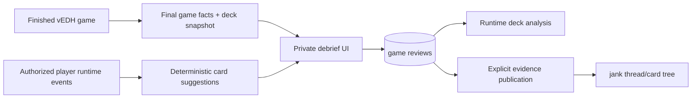

# vEDH Expert Post-Game Debrief PRD

**Status:** Approved for planning  
**Owner:** vEDH  
**Date:** 2026-08-17  
**Last reviewed:** 2026-08-19  
**Depends on:** [Runtime Game Intelligence Platform PRD](./2026-08-17-runtime-game-intelligence-platform-prd.md)  
**Primary launch audience:** Serious and professional deck testers

## 1. Executive Summary

### Problem Statement

The most valuable post-game knowledge often exists only in a player's memory: which cards enabled the plan, which card disappointed, what decision mattered, and what should change before the next session. Existing vEDH analysis displays recorded facts, but it does not give each player a structured place to interpret those facts while the game is fresh.

Expert-workflow research shows a durable analysis shape: identify the deck version, result, ending turn, a small number of meaningful positive and negative card assessments, and free-form notes. The source data itself is irrelevant to this feature; only that information shape informs the requirements.

### Proposed Solution

Add a private, optional debrief to every completed vEDH game. vEDH automatically supplies factual fields from the game record and asks the player only for interpretation: up to three contributing cards, one underperforming card, structured lesson tags, and free-form notes.

The debrief becomes the bridge between runtime events and longitudinal deck analysis. It should take less than two minutes, preserve expert nuance, and never block leaving or replaying a game.

Its primary product role is to convert fresh game memory into an evidence-linked next action that can later be connected to an immutable deck revision.

### Success Criteria

This feature contributes to the platform north-star target: at least 30% of the 30 activated serious testers in the six-week beta record at least three completed games for one deck lineage, inspect the evidence, and create a documented deck revision within a rolling 14-day window. The debrief supplies the revision hypothesis or next action used to document that change.

The following are supporting serious-tester beta targets:

- At least 35% of finished games in the invited tester cohort receive a saved debrief from at least one participant within 24 hours.
- Median completion time for a submitted debrief is at most 90 seconds; p90 is at most 3 minutes.
- At least 70% of submitted debriefs include either one canonical card assessment plus notes, or two canonical card assessments.
- At least 95% of debrief openings show the correct result, deck snapshot, and ending turn without player correction.
- At least 30% of testers who submit one debrief submit another within 14 days.

## 2. User Experience & Functionality

### User Personas

#### Professional / Competitive Tester

Needs a fast, repeatable testing journal that separates gameplay facts from hypotheses and survives frequent deck revisions.

#### Serious Brewer

Wants to capture why a game felt good or bad without building a spreadsheet or remembering a custom note format.

#### Casual Player

May want a short memory of a memorable game but should not face an expert-only form or a mandatory workflow.

#### Deck Analyst

Reviews many games later and needs structured card references alongside the original narrative.

### User Stories

#### Story PGR-1: Start from automatically recorded facts

As a player, I want vEDH to prefill what it already knows so that my debrief is reflection, not bookkeeping.

**Acceptance Criteria**

- The debrief is available when a game becomes `FINISHED`; its submitted content remains editable indefinitely by its author through immutable revisions.
- It displays the player's result, ending turn/round, format, commanders/leaders, opponents, duration, and immutable deck snapshot.
- Factual values are derived from canonical game records and cannot be silently overridden by review text.
- If a factual field is unknown or incomplete, the UI says `Not recorded`; it never substitutes zero.
- A correction flow is separate from the review and leaves an audit trail.
- Opening the debrief does not create an empty submitted review.

#### Story PGR-2: Identify meaningful card contributions

As an expert tester, I want to identify a few cards that materially helped or hurt so that patterns can emerge across games.

**Acceptance Criteria**

- The default form accepts up to three `contributor` card assessments and one `underperformer` card assessment.
- Card selection resolves to canonical card IDs from the exact deck snapshot used in the game.
- Cards present in the player's recorded runtime activity are suggested first, but the player may select any card from the snapshot.
- The UI distinguishes `recorded in this game` from `selected from deck`; it does not imply a card was drawn or played without evidence.
- Each assessment may include an optional short explanation bounded to 500 characters.
- Duplicate selection of the same card and assessment type is prevented.
- The product labels these as player assessments, not objective card-performance scores.

#### Story PGR-3: Capture the lesson in the player's own words

As a player, I want a flexible note field so that table politics, sequencing, matchup texture, and unusual decisions are not lost.

**Acceptance Criteria**

- The form provides a plain-text or safe-markdown note field of up to 10,000 characters.
- Drafts autosave locally or server-side without becoming public or counted as submitted reviews.
- The author may edit submitted notes indefinitely. Each submitted edit creates a new immutable review revision rather than overwriting the prior submission.
- Draft autosaves between submissions do not create immutable revisions or change the version used by analysis.
- The note supports links to turns or events in the game timeline.
- A player can submit a useful review with notes only, card assessments only, or both.
- Search indexes only the current user's private notes unless the user explicitly publishes a review.
- Notes are never written to product-event metadata, application logs, or Prometheus labels.

#### Story PGR-4: Classify lessons without flattening them

As an analyst, I want a small controlled vocabulary for recurring lessons so that I can filter reviews while preserving the full narrative.

**Acceptance Criteria**

- The MVP vocabulary includes: `mulligan`, `mana`, `sequencing`, `interaction`, `threat-assessment`, `politics`, `win-attempt`, `resilience`, `matchup`, `rules-error`, and `deck-construction`.
- A review may select zero to five lesson tags.
- Lesson tags are hidden behind an `Add detail` action in the default debrief so the primary workflow remains card assessments, notes, and next action.
- The vocabulary is versioned and additions do not rewrite historical selections.
- Free-form tags are not supported in MVP.
- Tags describe the lesson, not a moral judgment about a player.

#### Story PGR-5: Decide what to do next

As a deck tester, I want to record a follow-up decision so that the debrief can lead to a concrete experiment.

**Acceptance Criteria**

- A review may include one optional next action: `no-change`, `watch-card`, `consider-cut`, `consider-add`, `change-pilot-plan`, or `needs-more-games`.
- Card-specific actions reference canonical cards or unresolved free-text candidates explicitly.
- A next action remains a hypothesis until the user applies a deck revision.
- When a related deck revision is later created, the user can link the action to the new snapshot.
- The analytics UI can filter reviews by open and resolved next actions.

#### Story PGR-6: Keep reflection private or share it deliberately

As a player, I want control over who can read my analysis so that candid testing notes do not become public forum content accidentally.

**Acceptance Criteria**

- New reviews are private to the author by default.
- A player may share a review with game participants or publish a sanitized excerpt to jank.
- Publishing requires a preview showing the exact note, card assessments, and game facts that will become visible.
- Sharing with game participants uses the same exact-content preview but requires no additional mandatory redaction workflow.
- Publication does not require consent from every game participant when the excerpt contains only the author's selected interpretation, authorized public gameplay facts, and approved evidence from the author's perspective.
- Public opponent identifiers are replaced at read time with publication-scoped pseudonyms, and hidden-zone facts are excluded unless separately authorized.
- Pseudonymization does not mutate the canonical review, game, participant, or event records; authorized views retain the original identity relationships.
- Revoking publication removes the linked evidence content from jank while preserving a tombstone explaining that the source is no longer public.
- Moderators cannot make a private review public.

#### Story PGR-7: Skip without friction

As a player who does not want to debrief, I want to leave immediately so that analysis never obstructs gameplay.

**Acceptance Criteria**

- The debrief is dismissible with one action.
- Dismissal never blocks navigation, rematch, invite sharing, or account claim.
- A non-blocking reminder may appear once within 24 hours; repeated nagging is prohibited.
- The form remains available from the completed game's analysis page.
- Product metrics distinguish `viewed`, `drafted`, `submitted`, `dismissed`, and `not_seen` without storing review content.

### Non-Goals

- Importing or migrating the expert-workflow reference spreadsheet.
- Requiring a debrief after every game.
- Asking the user to re-enter result, turn, decklist, commander, or observed card activity.
- Producing an objective `best card` or `worst card` ranking from subjective assessments.
- Full coaching, automatic deck cuts, or LLM-written reviews.
- Public opponent ratings, blame assignment, or sportsmanship scores.
- Replacing the factual timeline or runtime deck analysis dashboard.

## 3. AI System Requirements

### Applicability

No AI is required for the MVP. Card suggestions are deterministic: cards from the deck snapshot are ranked by whether they appear in the player's authorized runtime events, then alphabetically or by recent use.

### Future Tool Requirements

Future assistance may summarize the author's own submitted reviews or propose recurring themes. It may not generate a review before the player supplies interpretation, infer hidden information, or publish without explicit approval.

### Evaluation Strategy

Any future review summarization must:

- cite every source review and game;
- preserve negative, contradictory, and uncertain observations;
- achieve at least 90% theme-recall and 95% citation entailment on a human-labeled expert-review set;
- label proposed deck changes as hypotheses;
- exclude private reviews from any cross-user model context.

## 4. Technical Specifications

### Architecture Overview

The existing `GameAnalysisView.vue` is the preferred vEDH entry point. The form should extend the completed-game experience instead of introducing an unrelated journal route.

### Core Data Entities

#### `game_reviews`

- `id` UUID
- `game_id`
- `author_user_id`
- `deck_snapshot_id`
- `visibility`: private, participants, published-excerpt
- `current_submitted_revision_id`, nullable until first submission
- created and updated timestamps
- one logical review per game and author

Result and ending turn are **not** copied into editable review fields; they are joined from canonical game facts.

#### `game_review_drafts`

- logical review ID
- mutable notes, card assessments, lesson tags, and next action
- lesson vocabulary version
- updated timestamp

Only the author can read or mutate a draft. Draft content is excluded from analysis and publication until submitted.

#### `game_review_revisions`

- immutable revision ID and logical review ID
- revision number
- submitted notes
- lesson vocabulary version
- next-action type and optional canonical card ID or unresolved label
- author user ID
- submitted timestamp
- optional edit reason

The latest submitted revision drives the author's private longitudinal analysis. Historical revisions remain inspectable by the author and are not averaged together as separate reviews.

#### `game_review_revision_card_assessments`

- review revision ID
- canonical card ID
- assessment type: contributor or underperformer
- rank/position
- optional explanation
- `observed_in_runtime` derived flag or source-event reference

#### `game_review_revision_lesson_tags`

- review revision ID
- controlled lesson tag
- vocabulary version

#### `published_evidence_excerpts`

- stable evidence ID
- source review ID
- source review revision ID
- publisher user ID
- sanitized content snapshot or version reference
- publication status and timestamps
- visibility policy

### Integration Points

#### vEDH Game Analysis

- Reads final facts and author-scoped timeline events.
- Creates and edits drafts.
- Submits the review through an authenticated mutation.
- Displays existing review alongside factual charts and timeline.

#### Runtime Deck Analysis

- Counts submitted assessments separately from observed card activity.
- Exposes assessment rates per eligible reviewed game and sample size.
- Links every aggregate back to source reviews the viewer can access.

#### jank

- Consumes only explicitly published evidence excerpts.
- May link an excerpt to a post, thread, card-tree node, or annotation.
- Cannot mutate the canonical private review from a forum action.

### API Requirements

The exact naming is implementation-level, but GraphQL must support:

- fetch/create/update the current user's review for a game;
- submit or return a review to draft;
- search canonical cards within the associated deck snapshot;
- fetch deterministic card suggestions and their event basis;
- publish, preview, and revoke a sanitized excerpt;
- query the user's submitted reviews by deck snapshot, lesson tag, card, and next-action status.

All mutations enforce `game participant == authenticated user` for the authoring identity.

### Security & Privacy

- Reviews are author-private by default and stored outside product analytics.
- Database queries enforce author or explicitly shared visibility; the frontend is not the security boundary.
- Public excerpts are separately materialized publication records; they do not destructively redact or overwrite the private source review.
- A published excerpt remains pinned to its source review revision. Later note edits do not silently change public evidence; the author must explicitly preview and publish an updated excerpt.
- Account deletion enters a 30-day recovery period. After that period, private review drafts and all submitted revisions are permanently deleted and any published excerpts sourced from them are revoked.
- Review content is encrypted in transit and covered by the platform backup and deletion policies.
- Safe-markdown rendering strips scripts, event handlers, unsafe URLs, and embedded remote content not permitted by policy.
- Publishing creates an audit record and preview; revocation is supported.
- Other participants cannot edit, delete, or quote a private review.
- Moderator access is limited to content actually published into moderated forum surfaces.

### Testing Requirements

- Unit tests cover result/turn/deck prefill, unknown fields, card suggestion order, limits, tags, and next actions.
- Integration tests prove review authorship and private visibility.
- Authorization tests cover participant, nonparticipant, guest, claimed guest, moderator, published, and revoked states.
- Browser tests prove submit, dismiss, resume draft, publish preview, and revoke flows.
- Analytics reconciliation tests separate runtime activity from subjective assessments.
- Accessibility tests cover keyboard-only card selection, labels, errors, autosave state, and screen-reader announcements.

## 5. Risks & Roadmap

### Phased Rollout

#### MVP: Fast Private Debrief

- Auto-filled final facts.
- Up to three contributor cards and one underperformer.
- Notes and controlled lesson tags.
- One optional next action.
- Private drafts and submission.
- Review visible from the finished-game analysis page.

#### v1.1: Review Workflow

- Timeline deep links from notes.
- Link next action to a resulting deck revision.
- Personal review search and filters.
- Participant sharing.
- Explicit sanitized publication to jank.

#### v2.0: Assisted Synthesis

- Evidence-cited summaries across the player's own reviews.
- Contradiction and insufficient-sample warnings.
- Suggested experiments, never automatic deck edits.

### Dependencies

- Complete result semantics and immutable deck snapshots.
- Stable user identity across guest claim.
- Authorization-aware game timeline.
- Canonical card IDs shared by runtime events and deck snapshots.
- Evidence publication contract for jank.

### Technical Risks

#### Low completion rate

Even expert players may skip a form after a long game.

**Mitigation:** automatic facts, under-two-minute target, optional fields, autosave, and no blocking modal.

#### Suggestion bias

Showing cards from logged activity first can anchor the player's judgment.

**Mitigation:** explain the sort, allow full-deck search, and never preselect an assessment.

#### Private-note leakage

Candid notes may contain opponent names, mistakes, or strategic information.

**Mitigation:** private default, explicit publication preview, separate published excerpt, and server-side visibility enforcement.

#### Subjective data presented as fact

Repeated `contributor` tags can look like causal performance statistics.

**Mitigation:** separate schemas and visual language for observed events versus player assessments; show denominators and source reviews.
