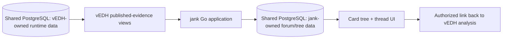

# jank Evidence-Backed Card Trees PRD

**Status:** Approved for planning  
**Owners:** vEDH and jank  
**Date:** 2026-08-17  
**Last reviewed:** 2026-08-19  
**Depends on:** [Runtime Game Intelligence Platform](./2026-08-17-runtime-game-intelligence-platform-prd.md) and [Runtime Deck Analysis](./2026-08-17-runtime-deck-analysis-prd.md) PRDs  
**Source repository:** [dylanlott/jank](https://github.com/dylanlott/jank)

## 1. Executive Summary

### Problem Statement

Forum discussions about cards and decks are usually disconnected from the games that motivated them. A user can claim that a card overperformed, a package is essential, or a matchup is unfavorable, but readers cannot easily inspect the deck version, runtime pattern, sample, or source games behind the statement.

jank already has annotated card trees scoped to boards and threads. Its current nodes store a card name and parent relationship, while annotations store a kind, body, label, tags, and optional source post. The missing capability is to connect that expressive structure to vEDH's runtime evidence in the shared database.

### Proposed Solution

Make card trees the community interpretation layer for vEDH runtime analysis. Users will be able to create a tree from a deck snapshot or analysis view, organize cards into typed relationships, attach published game evidence to nodes and annotations, and discuss hypotheses in a linked jank thread.

Runtime facts remain owned and calculated by vEDH. jank stores the discussion, tree structure, annotations, and durable references to evidence publications. This preserves one database and one platform identity without creating two sources of truth.

jank is the final discussion stage of the platform loop—after play, evidence capture, reflection, comparison, and a documented deck revision—not an independent analytics source of truth.

### Success Criteria

The following are supporting targets for the approved six-week, 30-activated-tester beta:

- At least 25% of users who publish a vEDH deck-analysis slice attach it to a jank thread or card tree within seven days.
- At least 50% of card-tree nodes created from a vEDH analysis contain either a runtime evidence link or an explicit `hypothesis without evidence` state.
- At least 20% of viewers of an evidence-backed tree open a source analysis, game excerpt, or calculation definition.
- At least 10% of evidence-backed tree views result in a reply, quote, annotation, follow, or tree fork during the beta.
- Zero private or revoked vEDH evidence records are exposed through jank in automated authorization tests or beta incident reports.

## 2. User Experience & Functionality

### User Personas

#### Deck Author / Tester

Wants to turn repeated game observations into a structured explanation of card roles, packages, dependencies, and possible changes.

#### Testing Teammate

Needs to challenge or refine a hypothesis using the exact games and deck version behind it.

#### Forum Participant

Wants to discuss a card or branch without losing the context of the overall deck plan.

#### Community Reader

Wants useful runtime-backed analysis without gaining access to private game state or personal notes.

#### Moderator

Needs evidence-backed posts to follow existing reporting, deletion, and moderation behavior without acquiring access to unpublished gameplay data.

### User Stories

#### Story JCT-1: Create a card tree from a real deck version

As a deck author, I want to initialize a tree from a vEDH deck snapshot so that I do not retype the list or lose the version that produced the analysis.

**Acceptance Criteria**

- A user can create a draft card tree from an authorized deck lineage, immutable snapshot, or published analysis slice.
- A tree is a durable standalone artifact. Draft and public trees do not require an owning board or thread.
- A public tree may link to an optional discussion thread, created only when an author or reader starts a discussion.
- Nodes resolve to canonical platform card IDs and retain a display-name snapshot.
- The import preview shows included cards, unresolved cards, proposed roots, and existing tree conflicts before saving.
- The user can choose all cards or a filtered subset from the analysis.
- Creating a tree does not mutate the vEDH deck snapshot.
- The tree records its source snapshot and analysis calculation version.
- Existing manually created board- and thread-scoped trees remain supported.

#### Story JCT-2: Express card relationships, not just indentation

As an analyst, I want to label why a card sits beneath another card so that the tree represents a claim rather than an unexplained hierarchy.

**Acceptance Criteria**

- A child relationship may use one of: `supports`, `enables`, `finds`, `protects`, `recurs`, `replaces`, `competes-with`, `punishes`, `meta-answer`, or `custom`.
- Relationship type is optional for legacy trees and required for new evidence-backed trees after the beta migration window.
- A custom relationship requires a bounded display label.
- Custom relationship labels are public and searchable but do not become global filter categories unless promoted into a later controlled-vocabulary version.
- Relationship types are explanatory metadata, not rules-engine assertions.
- Reparenting or reordering nodes creates an auditable tree revision.
- Keyboard-accessible reorder and reparent controls are available alongside drag-and-drop.

#### Story JCT-3: Attach runtime evidence to a card or claim

As a tester, I want to cite selected vEDH evidence on a node or annotation so that readers can inspect the basis for my claim.

**Acceptance Criteria**

- A node or annotation can reference one or more published vEDH evidence IDs.
- The attachment preview shows deck snapshot, eligible-game count, filters, sample dates, calculation version, redactions, and publication owner.
- jank stores the stable evidence reference, not a copied raw game payload.
- Public evidence may be published by its vEDH author without unanimous game-participant consent when the approved payload is limited to that author's perspective, public gameplay facts, approved aggregates or excerpts, and the author's interpretation.
- Public opponent labels are publication-scoped pseudonyms supplied by vEDH; jank never destroys, rewrites, or owns the canonical participant mapping.
- An annotation distinguishes `observation`, `player-assessment`, `hypothesis`, `revision-plan`, and `counterexample`.
- Evidence links may cite a published aggregate, a sanitized game excerpt, or a published debrief excerpt.
- Single-game evidence is allowed and displays its exact sample size, including `n=1`; jank does not imply that publication establishes a general pattern.
- Probabilistic inference appears only when explicitly selected in the vEDH publication and retains its confidence, category, source references, and inference version.
- A claim without evidence is allowed but visibly labeled `Unsubstantiated hypothesis`.
- Revoked evidence becomes unavailable without deleting the node, annotation, or discussion around it.

#### Story JCT-4: See runtime context directly on the tree

As a reader, I want compact runtime indicators on a card node so that I can decide where to investigate without opening every game.

**Acceptance Criteria**

- Evidence-backed nodes may show eligible games, observed games, acted games, contributor assessments, underperformer assessments, and source count.
- Every number includes or reveals its denominator and calculation version.
- Indicators derived from vEDH inference display their evidence class and inference version; probabilistic values also show confidence and never replace observed counts.
- No node is labeled `best`, `worst`, `staple`, or `cut` solely from runtime correlation.
- Small samples display `Limited evidence` instead of a performance rank.
- Selecting an indicator opens the authorized vEDH analysis slice or source evidence.
- Private viewers may see their own richer evidence; anonymous viewers see only the published evidence snapshot.
- A revoked or recalculated source is labeled clearly.

#### Story JCT-5: Discuss and quote evidence in a thread

As a forum participant, I want to quote a tree node and its evidence in a reply so that discussion stays anchored to the exact claim.

**Acceptance Criteria**

- A tree node has a `Discuss` action that opens its linked thread or creates one on first use, then inserts a stable node/evidence reference into the reply composer.
- Rendered references show card, claim label, tree revision, and evidence status.
- Replies can attach counterexample evidence without modifying the original claim.
- Post backlinks include references from tree annotations and evidence discussions.
- Existing jank reporting and soft-deletion flows apply to posts containing evidence references.
- Deleting a post does not delete vEDH evidence or unrelated card-tree content.
- Deleting or archiving a linked discussion thread does not delete the standalone tree.

#### Story JCT-6: Compare and fork analytical trees

As a testing teammate, I want to propose an alternate structure without destroying the author's work so that competing deck hypotheses can coexist.

**Acceptance Criteria**

- Users can preview tree changes before save.
- A user with permission may create a new revision or fork a public tree.
- A diff shows added, removed, moved, relabeled, and evidence-changed nodes.
- Fork attribution links to the source tree and revision.
- A fork is a new standalone tree with its own optional discussion thread and backlinks to the source tree and source thread.
- A source tree and its forks never share an owning discussion thread, although posts may reference any related tree.
- Evidence references retain their original publication owner and visibility.
- Merging is not required for MVP; authors may manually apply selected changes.

#### Story JCT-7: Use one vEDH identity across gameplay and discussion

As a player, I want my vEDH account to work in jank so that my games, analysis publications, trees, and posts have one stable owner.

**Acceptance Criteria**

- vEDH owns the single canonical platform `users` table, and the same UUID user row is used by both vEDH and jank.
- jank does not create, mirror, synchronize, or link a second platform account row and does not own platform credentials.
- Every jank-owned author or creator foreign key references the canonical user UUID directly.
- Existing integer-keyed jank users are handled by a one-time database migration that creates or selects the canonical UUID row and rewrites all jank foreign keys before the legacy user table is retired; there is no user-facing account-linking state after cutover.
- Migration conflicts are resolved administratively and block cutover for the affected row rather than leaving two active identities.
- Forum display names are separable from login identity and historical author display snapshots.
- Guest users can view public content; posting and public evidence publication follow the approved account policy.
- Guest-to-account claim updates the canonical vEDH user row or its documented identity relationship once, preserving game evidence, posts, trees, annotations, and moderation history across both applications.

### Non-Goals

- Allowing jank to recompute vEDH analytics from raw event JSON.
- Copying private game logs, hands, libraries, or notes into forum tables.
- Treating a card tree as a rules engine, combo verifier, or automatic causal graph.
- Importing or preserving the expert-workflow reference spreadsheet.
- Automatically publishing a completed game's review.
- Replacing ordinary linear threads and posts.
- Building real-time collaborative tree editing in MVP.
- Automatically merging tree forks.

## 3. AI System Requirements

### Applicability

No AI is required for MVP. Tree creation from a deck snapshot, evidence badges, diffs, canonical card resolution, and source linking are deterministic.

### Future Tool Requirements

Future assistance may suggest an initial tree structure or summarize a discussion only from authorized deck, evidence, and thread context. The user must approve every created node, edge, annotation, and publication.

### Evaluation Strategy

Any future assisted card-tree feature must:

- preserve all source card IDs and evidence references;
- achieve at least 95% valid relationship-label precision on a human-reviewed domain set before automatic suggestions are shown;
- cite the source evidence for every suggested runtime claim;
- label uncited structural suggestions as hypotheses;
- never publish or change a tree without explicit user confirmation;
- exclude private game evidence from public or cross-user prompts.

## 4. Technical Specifications

### Architecture Overview

The two logical stores may live in one PostgreSQL database, but ownership is explicit. vEDH remains the sole writer and calculator for runtime facts and analysis publications. jank remains the sole writer for forum and card-tree structure.

### Current jank Baseline

At the inspected repository revision, jank provides:

- Go with PostgreSQL by default and optional SQLite development mode.
- Boards, threads, posts, profiles, search, and moderation.
- Card trees scoped to a board or thread.
- Parent/child card nodes using card-name strings and positional ordering.
- Node annotations with kind, body, label, tags, and optional source post.
- REST endpoints and HTML views for creating, reading, and editing trees.
- A documented roadmap item for vEDH gameplay summaries, timelines, and resource graphs.

Relevant primary-source files include [README.md](https://github.com/dylanlott/jank/blob/dc322ae366c14b231f2694b63fd34390df7447b0/README.md), [TODO.md](https://github.com/dylanlott/jank/blob/dc322ae366c14b231f2694b63fd34390df7447b0/TODO.md), and [app/models.go](https://github.com/dylanlott/jank/blob/dc322ae366c14b231f2694b63fd34390df7447b0/app/models.go).

### Core Data Changes

#### `card_trees`

Add or migrate toward:

- canonical `owner_user_id` UUID;
- optional source deck lineage ID;
- optional source deck snapshot ID;
- optional linked discussion thread and optional legacy board scope using explicit foreign keys;
- visibility: draft/private, unlisted, public;
- current revision number;
- source calculation version.

#### `card_tree_nodes`

Add:

- canonical card ID;
- card display-name snapshot;
- relationship kind to parent;
- optional custom relationship label;
- revision/audit metadata.

Legacy `card_name` data remains readable during migration and is resolved explicitly; failed resolutions are not silently rewritten.

#### `card_tree_annotations`

Standardize `kind` to:

- observation;
- player-assessment;
- hypothesis;
- revision-plan;
- counterexample;
- note.

Keep post-source references and add structured evidence linkage rather than overloading `source_post_id`.

#### `card_tree_evidence_links`

- stable link ID
- tree/node/annotation target using a schema that preserves referential integrity
- vEDH evidence-publication ID
- creator user UUID
- optional label/comment
- created timestamp
- cached non-sensitive display metadata only when required for resilience

#### `card_tree_revisions`

- tree ID and revision number
- author user UUID
- created timestamp and message
- normalized structural snapshot or change set
- source/fork revision where applicable

### Shared Database and Identity Integration

The current applications define incompatible `users` tables. The production contract permits only one canonical platform account table and requires a one-time migration before integration:

- vEDH owns the canonical platform user table and UUID; vEDH and jank reference the exact same account row.
- jank authentication validates the vEDH platform session or uses an approved identity adapter backed by that same row.
- jank owns no password hash, guest secret, credential mirror, or account-linking table.
- jank-owned content stores `author_user_id`/`created_by_user_id` UUID foreign keys plus immutable display-name snapshots where historical rendering requires them.
- Username strings are not authorization keys.
- vEDH and jank use separate migration histories and may use logical schemas such as `vedh` and `jank` if selected by engineering.
- Database roles prevent jank from reading raw credentials, guest secrets, private reviews, hidden zones, or unrestricted event payloads.

### Integration Points

#### vEDH Published Evidence

jank reads a versioned interface that supplies:

- evidence ID and status;
- creator and visibility-safe attribution;
- canonical card IDs;
- deck snapshot/lineage display metadata;
- aggregate facts, denominators, filters, and calculation version;
- authorized source links;
- revocation/redaction status.

#### jank Forum

- Threads and posts embed stable tree and evidence references using safe markdown/render tokens.
- Moderation operates on forum content, not the underlying vEDH record.
- Search indexes public card names, relationship labels, annotation text, and evidence display summaries, but not private evidence content.

#### Card Resolution

- jank should prefer the platform canonical card table/API used by vEDH instead of relying on browser-only Scryfall validation as the authoritative identity.
- Scryfall may remain a presentation/art source subject to its terms and rate limits.
- Unresolved and custom cards remain explicit.

### API Requirements

The existing REST design may be extended; GraphQL is not required for jank. The interface must support:

- create a draft tree from deck snapshot or evidence publication;
- preview and confirm bulk node creation;
- typed node relationships;
- attach/detach evidence references;
- fetch evidence display status;
- tree revision, diff, and fork;
- discussion-link generation;
- visibility changes and publication preview.

All write endpoints authorize by canonical user UUID and validate that referenced evidence is accessible to that user.

### Security & Privacy

- A stable evidence ID is not proof of authorization; jank checks the approved evidence view on every detail request.
- Public pages render only public publication payloads.
- Trees created from private vEDH analysis begin as private drafts. Creating or importing a tree never implicitly publishes its evidence.
- Anonymization is a vEDH read-model transformation: jank stores opaque evidence references and public display snapshots, while canonical participant identity remains intact in vEDH.
- When a vEDH account passes its 30-day deletion recovery period, jank treats all evidence publications owned by that account as revoked; surrounding tree and thread content retains only a non-sensitive tombstone.
- Revocation and redaction invalidate caches promptly and leave a non-sensitive tombstone.
- Forum moderators can remove public discussion but cannot access or republish private vEDH records.
- Tree imports and annotations are size-bounded and sanitized.
- Cross-application links use opaque IDs and validated origins.
- Database credentials are separated by application role even when the physical database is shared.

### Testing Requirements

- Migration tests cover existing jank users, username-authored content, legacy card-name nodes, and both PostgreSQL and supported SQLite development mode where practical.
- Contract tests verify the published-evidence view and revocation behavior.
- Authorization tests cover owner, participant, public reader, unrelated user, guest, moderator, revoked, redacted, and deleted-account cases.
- API tests cover bulk creation, canonical resolution, relationship validation, evidence attachment, revision, diff, and fork.
- Browser tests cover create-from-analysis, preview, edit, discuss, evidence drill-down, inaccessible evidence, and keyboard reordering.
- Search tests prove private and revoked evidence content is never indexed.
- Load tests cover a 500-node tree with 2,000 annotations/evidence links.

## 5. Risks & Roadmap

### Phased Rollout

#### MVP: Evidence-Linked Trees

- Unified vEDH identity in jank.
- Canonical card IDs on new nodes.
- Create a draft tree from a deck snapshot or published analysis.
- Attach published evidence to nodes and annotations.
- Compact evidence indicators and links back to vEDH.
- Thread discussion links.
- Standalone tree routes with optional discussion-thread creation.
- Revocation-safe rendering.

#### v1.1: Tree Revision and Collaboration

- Typed relationships required for evidence-backed trees.
- Drag/drop plus keyboard reorder.
- Compare-before-save.
- Tree revisions and diffs.
- Public forks and counterexample evidence.

#### v2.0: Community Knowledge Layer

- Team-owned trees.
- Cross-tree comparison and reusable card packages.
- Privacy-bounded aggregate discovery.
- Evidence-grounded assisted structure suggestions.

### Dependencies

- One canonical platform user table and completed one-time jank foreign-key migration.
- Canonical card IDs available to both applications.
- vEDH analysis evidence publication and revocation.
- Shared-database schema ownership and least-privilege roles.
- Runtime Deck Analysis calculation definitions and stable evidence URLs.

### Technical Risks

#### Identity/table collision

Both applications currently own incompatible `users` schemas.

**Mitigation:** treat identity migration as a hard precondition, designate vEDH as the sole account-table owner, rewrite jank foreign keys to canonical UUID rows, retire the legacy jank user table, and test both migration histories against one database.

#### Stale evidence

A tree can outlive or misrepresent a recalculated or revoked analysis.

**Mitigation:** stable publication versions, live status checks, revocation tombstones, and visible calculation versions.

#### Forum claims appear more authoritative than evidence supports

Badges and charts can lend certainty to anecdotes or tiny samples.

**Mitigation:** denominators, limited-evidence states, explicit annotation types, counterexample support, and no automatic ranking language.

#### Raw database access bypasses product authorization

Sharing PostgreSQL can tempt direct joins against private tables.

**Mitigation:** least-privilege roles, approved views/functions, automated permission tests, and schema ownership reviews.

#### Card identity migration

Existing nodes contain free-text names validated in the browser.

**Mitigation:** explicit resolution preview, unresolved legacy state, canonical ID plus display snapshot, and no silent fuzzy rewrite.
