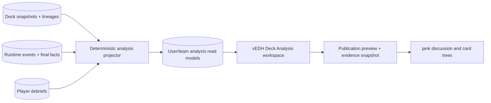

# vEDH Runtime Deck Analysis PRD

**Status:** Approved for planning  
**Owner:** vEDH  
**Date:** 2026-08-17  
**Last reviewed:** 2026-08-19  
**Depends on:** [Runtime Game Intelligence Platform](./2026-08-17-runtime-game-intelligence-platform-prd.md) and [Expert Post-Game Debrief](./2026-08-17-expert-post-game-debrief-prd.md) PRDs  
**Primary launch audience:** Serious and professional deck testers

## 1. Executive Summary

### Problem Statement

Deck-analysis products primarily explain what a list contains, how popular its cards are, or how a deck goldfishes in an isolated playtester. A serious tester needs a different view: how an exact deck version performed across real multiplayer games, which runtime patterns recurred, what changed between revisions, and which conclusions are supported by inspectable evidence.

vEDH already owns the runtime record. It needs a longitudinal deck-analysis product that converts canonical game facts and player debriefs into careful, source-linked analysis without overstating correlation as causation.

### Proposed Solution

Create a Deck Analysis workspace organized around a deck lineage and its immutable snapshots. The workspace combines game outcomes, turn/resource distributions, runtime card activity, player assessments, matchup/context filters, version comparison, and links to source games.

The workspace is the decision point in the platform loop: after at least a small series of games, the tester inspects evidence, records a hypothesis, and connects that hypothesis to the next immutable deck snapshot.

The workspace will distinguish:

- **Deck facts:** cards and revisions.
- **Observed runtime facts:** recorded state changes, results, and timing.
- **Derived runtime facts:** actions deterministically implied by recorded events.
- **Inferred runtime hypotheses:** probable actions or causal candidates with versioned provenance and confidence.
- **Player assessments:** contributor/underperformer tags and notes.
- **Analytical hypotheses:** interpretations created by a player or discussed in jank.

### Success Criteria

The feature's north-star target is at least 30% of the 30 activated serious testers in the six-week beta completing this loop within a rolling 14-day window: record at least three completed games for one deck lineage, inspect that lineage's evidence, and create a documented deck revision. A documented revision is a new snapshot linked to the lineage with a revision hypothesis or debrief next action.

The following are supporting beta targets:

- At least 40% of serious testers with five or more eligible games open Deck Analysis in a rolling 30-day period.
- At least 25% of Deck Analysis sessions open a source game, timeline event, debrief, or deck-version diff.
- At least 15% of users with ten or more eligible games create or link a deck revision within seven days of viewing analysis.
- Every displayed aggregate reconciles exactly to its eligible source games in automated fixtures and provides its sample size and inclusion rules.
- Deck summary queries across up to 10,000 games return within 1 second at p95 under the documented beta load profile.

## 2. User Experience & Functionality

### User Personas

#### Professional / Competitive Tester

Compares repeated sessions and small deck changes, evaluates matchup plans, and needs evidence that can survive team review.

#### Serious Brewer

Wants to move beyond `this card felt good` and understand how frequently a pattern appears, under what conditions, and in which deck versions.

#### Testing Team

Needs a shared vocabulary and source games for reviewing conclusions without requiring every member to attend every session.

#### Community Reader

May see published summaries through jank, but should receive sanitized, evidence-linked data rather than private raw game histories.

### User Stories

#### Story RDA-1: Analyze a deck lineage without rewriting history

As a tester, I want related deck snapshots grouped into a lineage so that I can evaluate the deck over time while retaining exact per-game versions.

**Acceptance Criteria**

- A deck lineage has a stable identity owned by a user or testing group.
- Each eligible game references exactly one immutable snapshot per participating deck.
- vEDH automatically groups snapshots owned by the same user when they share a stable vEDH deck ID or trusted external deck ID; a changed content hash creates a new snapshot inside that lineage.
- Imports without a stable source identity require the user to select or create a lineage; the platform does not infer lineage from deck name or card-list similarity alone.
- The workspace can show all lineage games or a selected set of snapshots.
- The UI clearly states when a third-party source URL has changed but the historical snapshot has not.
- Users can name snapshots and record a short revision hypothesis.
- Users may split, merge, or move snapshots between lineages. Every change is auditable and does not alter any snapshot or game fact.

#### Story RDA-2: Understand outcomes and game pace

As a player, I want outcome and timing distributions so that I can evaluate speed, consistency, and the conditions under which the deck succeeds or fails.

**Acceptance Criteria**

- The summary shows eligible games, wins, losses, draws, no-contests, and incomplete games separately.
- Win rate uses game-weighted records, never an unweighted average of snapshot-level percentages.
- The workspace shows median, quartiles, distribution, and sample size for ending turn/round; mean and standard deviation may be secondary.
- Winning and losing turn distributions are computed from result fields, not row order or hardcoded ranges.
- Expected win share, when shown, derives from participant count and game rules rather than assuming a four-player 25% baseline.
- Filters disclose how many games they exclude.
- Facts and aggregates are displayed beginning with the first eligible game; sample size never hides or locks recorded data.
- Any comparison with fewer than three eligible games in either compared group displays `Limited evidence`, shows uncertainty, and avoids ranking language.

#### Story RDA-3: Inspect runtime card activity

As a tester, I want to understand how cards participated in games so that I can distinguish deck inclusion from actual runtime use.

**Acceptance Criteria**

- Card summaries use canonical card IDs and aggregate printings/faces according to a documented identity policy.
- Metrics distinguish deck inclusion, runtime observation, cast/played/action count, zone movement, resource contribution where deterministically available, and explicit player assessment.
- Card summaries may add inferred draws, combat participation, mana contribution, tutoring/searching, and causal candidates when the versioned inference layer supports them.
- Every activity value is labeled `Observed`, `Derived`, or `Inferred`, and selecting it reveals source events, calculation version, and confidence where applicable.
- Inferred values never overwrite or alter observed counts; users can filter the activity view by evidence class.
- Deterministic derivations and probabilistic categories meeting the platform's default-display quality gate appear automatically; lower-confidence values remain available under `Show speculative`.
- A card not present in recorded public activity is labeled `not observed`, not `not drawn`.
- Participant-private analysis may use the player's own hidden-zone facts if the platform recorded them and the user is authorized; public analysis may not.
- Raw contributor and underperformer counts are accompanied by rates per submitted review and eligible-game denominators.
- Selecting a card opens the source games and relevant timeline events.

#### Story RDA-4: Compare deck revisions

As a deck tester, I want to compare two snapshots so that I can evaluate whether a change behaved as expected.

**Acceptance Criteria**

- Snapshot comparison shows added, removed, quantity-changed, leader-changed, and unresolved cards.
- The comparison shows game counts and date/session ranges for each version.
- Outcome, pace, activity, and assessment deltas are available from the first eligible game and always disclose sample size and uncertainty.
- The product does not label a revision `better` solely from a higher observed win rate.
- A player may attach the revision hypothesis from a prior debrief next action.
- Every comparison can open the underlying games for either version.

#### Story RDA-5: Filter by runtime context

As an expert, I want to segment results by context so that a broad average does not hide matchup or table effects.

**Acceptance Criteria**

- MVP filters include snapshot, date/session, format, result, participant count, seat/order, opponent commander/leader when authorized, ending-turn range, and lesson tag.
- Filters operate only on recorded facts and explicitly submitted tags.
- Missing context is represented as `unknown` and remains filterable.
- Multi-select filters show the resulting eligible-game count before applying expensive charts.
- Public or team-shared filters respect evidence visibility and operate only within an explicitly materialized publication or shared-artifact scope.

#### Story RDA-6: Trace every conclusion to evidence

As a testing teammate, I want to inspect the games behind a metric so that I can challenge or refine the interpretation.

**Acceptance Criteria**

- Every chart point, table row, and card metric exposes an `Inspect games` action.
- Evidence lists preserve the active filters and calculation version.
- A source game shows the relevant timeline slice and any accessible player debrief.
- Exported analysis includes calculation definitions, filter parameters, and stable source IDs.
- If a source becomes inaccessible, aggregates are recalculated for the viewer's accessible dataset or marked as redacted.

#### Story RDA-7: Publish a bounded analysis to jank

As an analyst, I want to discuss a specific finding in jank so that the community can examine the evidence and improve the hypothesis.

**Acceptance Criteria**

- The user can create a publication preview from a selected analysis slice.
- The preview shows included games, fields, anonymization, sample size, calculation version, and card references.
- Publication creates an immutable evidence reference with revocation support.
- An author may publish analysis from a single eligible game. The publication must display the exact sample size, including `n=1`, and may not use ranking or certainty language unsupported by that sample.
- Publication is explicit and may be performed by the analyst without unanimous participant consent when it is limited to the analyst's perspective, public gameplay facts, approved aggregates or excerpts, and the analyst's own interpretation.
- Publishing a probabilistic inference requires explicit author selection and includes its confidence, inference category, source references, and version.
- Opponents are represented by publication-scoped pseudonyms in public responses; canonical participant links remain intact in private source records.
- jank receives aggregate facts and approved excerpts, not unrestricted runtime-event access.
- A published analysis can attach to a thread, post, card tree, or tree node.
- Replies and annotations cannot mutate the underlying vEDH calculation.

### Non-Goals

- Replacing deck construction, collection, price, legality, or purchase tools.
- Importing the expert-workflow reference spreadsheet or using its values as a benchmark.
- Presenting an inferred causal candidate as an observed fact or claiming that correlation alone proves causality.
- Ranking players, publishing opponent win rates, or creating a global Elo system in MVP.
- Automatic deck cuts or adds.
- Public cross-user aggregation before consent, cohort, privacy, and minimum-sample rules are approved.
- Full rules enforcement or adjudication; enrichment may infer gameplay concepts without becoming the canonical rules engine.
- Testing-group collaboration in MVP; the first release is private and individual.

## 3. AI System Requirements

### Applicability

No LLM is required for the MVP. Aggregates, filters, comparisons, and evidence selection remain deterministic and reproducible. Runtime enrichment may consume separately versioned deterministic or probabilistic inferences supplied by the platform inference layer.

### Future Tool Requirements

Future assisted analysis may formulate hypotheses from authorized facts and reviews, but it must consume the same versioned read models shown to the user and return stable evidence references.

### Evaluation Strategy

Any future assisted insight must:

- achieve 100% numeric reconciliation with deterministic query results;
- cite accessible source games for every factual claim;
- label correlation and hypothesis explicitly;
- distinguish source-linked causal facts from inferred causal hypotheses and correlation;
- surface conflicting reviews and version differences rather than averaging them away;
- achieve at least 95% citation entailment on a human-reviewed expert-analysis dataset.

## 4. Technical Specifications

### Architecture Overview

The runtime event store remains canonical. Deck-analysis read models are rebuildable projections keyed by a calculation version.

### Analytical Definitions

#### Eligibility

- Finished games with a valid participant record and deck snapshot are eligible by default.
- Draws remain eligible and distinct.
- No-contest and incomplete games are excluded from win-rate calculations by default but reported separately.
- Corrections update projections without deleting the prior audit history.

#### Card Identity

- Canonical platform card/object ID is the join key.
- Printing identity is retained for provenance but rolled up to gameplay identity unless a metric explicitly concerns printing.
- Double-faced, transformed, token, copy, and custom-object behavior follows a documented per-game adapter policy.

#### Observation and Exposure

- `included`: card exists in the deck snapshot.
- `observed`: at least one authorized runtime event identifies the card.
- `derived`: a versioned deterministic rule establishes an action from observed events.
- `inferred`: a versioned probabilistic rule identifies a likely action or relationship with provenance and confidence.
- `acted`: the card performed an observed or deterministically derived typed game action, such as cast, played, activated, attacked, or equivalent where supported; probabilistic inferences are reported separately.
- `assessed`: the player explicitly tagged it in a submitted debrief.
- These states are not interchangeable and must not be collapsed into a single `played` metric.

#### Statistics

- All percentages show numerator and denominator.
- All comparisons show game count and session/date range.
- All rate estimates and comparisons show an uncertainty interval, including single-game results.
- Sample size never gates access to a fact, aggregate, filter, chart, or snapshot comparison.
- Comparisons with fewer than three eligible games in either group display `Limited evidence`; this warning does not hide the values or evidence drill-down.
- The product never introduces an automatic `better`, `worse`, or causal label solely because a sample passes a size threshold.
- No hardcoded baseline assumes a specific pod size.
- Calculation definitions and versions are user-visible.

### Core Data Entities and Read Models

#### `deck_lineages`

- stable lineage ID
- owner or team ID
- game system and format family
- name, status, and visibility
- created and retired timestamps

#### `deck_lineage_snapshots`

- lineage ID
- snapshot ID
- user label
- revision hypothesis
- ordering/effective date

#### `deck_runtime_summary_vN`

- lineage/snapshot and eligible-game dimensions
- result counts
- ending turn/round distribution
- participant count and seat dimensions
- calculation version and refresh timestamp

#### `card_runtime_summary_vN`

- lineage/snapshot/card dimensions
- eligible games
- included, observed, and acted counts
- action-type counts
- contributor and underperformer review counts
- accessible evidence IDs

#### `runtime_inference_summary_vN`

- lineage/snapshot/card and inference-category dimensions
- observed or derived source counts
- inferred counts and confidence distribution
- inference rule/model versions
- accessible source-event and inference IDs

#### `analysis_evidence_publications`

- publication ID
- creator user ID
- calculation version
- normalized filter definition
- approved aggregate payload
- included/redacted source references
- visibility, publication, and revocation timestamps

### Integration Points

#### vEDH

- Deck import and game creation establish snapshot/lineage relationships.
- Runtime events and finalization feed projections.
- Game Analysis supplies evidence timelines.
- Expert Post-Game Debrief supplies subjective assessments and lessons.

#### jank

- Reads published evidence records through approved shared-database views.
- Resolves canonical card IDs to card-tree nodes.
- Links discussion back to the calculation version and source evidence.
- Does not independently recompute vEDH metrics from raw event payloads.

#### Third-Party Deck Tools

- Source URLs may remain links and import sources.
- Third-party deck mutation does not rewrite a vEDH snapshot.
- The workspace may provide `Open source deck` and export actions without depending on a provider for historical analysis.

### API Requirements

The exact operation names remain implementation-level decisions. The API must support:

- deck lineages and snapshot membership;
- snapshot diffs;
- summary metric queries with normalized filters;
- card runtime summaries;
- drill-down from aggregate to accessible evidence;
- saved personal analysis views;
- publication preview, create, and revoke;
- calculation-definition and version discovery.

Filter inputs are typed and bounded. Arbitrary SQL, free-form metric expressions, and unbounded group-bys are prohibited.

### Security & Privacy

- Personal analysis defaults to the user's own games and reviews.
- Testing groups are deferred to v1.1. They use explicit owner, admin, and member roles.
- Group membership alone exposes no personal history. A user must explicitly share a lineage, game, or review; group aggregates include only shared artifacts.
- Leaving a group removes future access to nonpublic shared artifacts while retaining an audit record of prior group calculations and publications.
- Public evidence is materialized from an approved publication, not generated from raw tables on an anonymous request.
- Author-owned deck analysis has no minimum publication cohort; single-game publications are permitted with exact sample size, uncertainty, and pseudonymized opponents.
- Opponent identifiers are replaced at read time with publication-scoped pseudonyms; anonymization does not rewrite or delete canonical identities, participant relationships, or source events.
- Hidden-zone-derived private metrics cannot be published unless the policy explicitly permits their sanitized aggregate form.
- Anonymous readers cannot apply arbitrary filters to private or unpublished source games. Cross-user platform aggregates remain out of MVP and require a separate future cohort and consent policy.
- jank's database role reads only published evidence and platform-safe card/deck metadata views.

### Testing Requirements

- Golden analytical fixtures reconcile every displayed result and card metric to source events.
- Inference fixtures verify evidence-class labels, provenance, confidence, version changes, and additive recomputation without modifying observed metrics.
- Property tests cover wins, draws, incomplete games, variable participant counts, missing turns, corrections, and zero denominators.
- Snapshot diff tests cover quantities, leaders, unresolved cards, and identical content hashes.
- Authorization tests verify private, team, participant, public, revoked, and redacted evidence.
- Performance tests cover 10,000 games in one lineage and high-cardinality card/event histories.
- Browser tests cover filters, drill-down, snapshot comparison, publication preview, and empty/small-sample states.
- Accessibility tests cover charts with equivalent tables and keyboard-operable filters.

## 5. Risks & Roadmap

### Phased Rollout

#### MVP: Personal Runtime Deck Dashboard

- Lineages and snapshot history.
- Result and ending-turn distributions.
- Runtime card activity with explicit state definitions.
- Player assessment summaries.
- Source-game drill-down.
- Personal/private visibility only.

#### v1.1: Revision and Team Analysis

- Snapshot comparison.
- Saved filters and testing-session ranges.
- Linked review next actions and revision hypotheses.
- Team-scoped sharing.
- Owner/admin/member testing groups with explicit lineage, game, and review sharing; no account-wide implicit access.
- Evidence publication preview and jank links.

#### v2.0: Broader Runtime Intelligence

- Matchup and resource analysis for supported adapters.
- Public, privacy-bounded cohorts.
- Cross-TCG capability-aware metrics.
- Evidence-grounded assisted hypotheses.

### Dependencies

- Immutable deck snapshots and lineages.
- Complete game result semantics.
- Versioned runtime events and rebuildable projections.
- Expert Post-Game Debrief for subjective assessments.
- Canonical card identifiers shared with jank.
- Shared identity and evidence-publication policy.

### Technical Risks

#### Sparse and biased data

Players who review games may differ from those who do not, and early versions will have small samples.

**Mitigation:** disclose eligibility, missingness, samples, dates, and review coverage; avoid universal rankings.

#### Correlation mistaken for causation

Win-rate deltas across versions can reflect opponents, seats, pilots, or session context.

**Mitigation:** careful product language, context filters, uncertainty, revision hypotheses, and direct evidence drill-down.

#### Projection complexity

Changing event semantics can invalidate historical derived metrics.

**Mitigation:** versioned calculations, replayable projections, golden fixtures, and visible calculation versions.

#### Query explosion

Arbitrary filters across events, games, cards, and reviews can become expensive.

**Mitigation:** bounded typed filters, precomputed read models, query budgets, pagination, and async export for large requests.

#### Privacy inference

Granular public filters can reveal an opponent's game or hidden strategy.

**Mitigation:** private-first launch, explicit publication snapshots, exact sample disclosure, pseudonymization, and least-privilege jank views.
