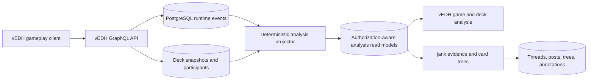

# vEDH Runtime Game Intelligence Platform PRD

**Status:** Approved for planning  
**Owner:** vEDH  
**Date:** 2026-08-17  
**Last reviewed:** 2026-08-19  
**Audience:** Product, engineering, data, and jank maintainers  
**Related PRDs:** [Expert Post-Game Debrief](./2026-08-17-expert-post-game-debrief-prd.md), [Runtime Deck Analysis](./2026-08-17-runtime-deck-analysis-prd.md), [Evidence-Backed Card Trees](./2026-08-17-jank-evidence-backed-card-trees-prd.md)

## 1. Executive Summary

### Problem Statement

TCG data products are predominantly deck-first: they describe which cards appear in lists, help users construct lists, and provide isolated playtesting. They do not generally turn a player's completed multiplayer games into durable, longitudinal evidence about how a particular deck version actually performed at runtime.

vEDH already observes the game itself. The product opportunity is to make authoritative gameplay data—not aggregated deck popularity—the foundation for replay, reflection, deck analysis, and evidence-backed community discussion across vEDH and jank.

The expert-workflow research that prompted this PRD is used only for the **shape of expert analysis**: outcome, ending turn, cards that materially helped or hurt, qualitative notes, and comparison across deck revisions. No source spreadsheet data is in scope for import, preservation, migration, or product decisions.

### Proposed Solution

Create a runtime game intelligence foundation that captures immutable deck snapshots, normalized gameplay events, final results, and per-participant visibility at the time a game is played. Expose those facts through stable read models that power vEDH analysis features and jank's card-tree discussions from the same PostgreSQL database.

The primary product loop is: **play -> capture evidence -> reflect -> compare versions -> revise the deck -> discuss the hypothesis in jank**. The MVP is successful when serious players use runtime evidence to make documented deck changes, not merely when the platform accumulates game logs.

The platform will keep four layers explicit:

1. **Observed facts:** server-recorded game, deck, card, turn, zone, and result events.
2. **Derived and inferred facts:** versioned conclusions computed from observed events, with provenance, method, and confidence.
3. **Player interpretation:** private or selectively shared post-game assessments and notes.
4. **Community interpretation:** jank threads, card-tree structure, and public annotations linked to authorized evidence.

### Success Criteria

The approved beta runs for six weeks with 30 activated serious testers. A tester becomes activated after completing one eligible game with a valid participant record and immutable deck snapshot.

The north-star target is at least 30% of activated testers completing this loop within a rolling 14-day window: record at least three completed games for one deck lineage, inspect that lineage's evidence, and create a documented deck revision. A documented revision means a new immutable snapshot linked to the lineage with a revision hypothesis or debrief next action.

The following are beta launch quality gates:

- At least 99.5% of accepted gameplay mutations that should emit a runtime event persist exactly one valid event or produce a visible, retryable error.
- At least 95% of finished beta games have a final result, ending turn, participant mapping, format, and immutable deck snapshot for every participating user who loaded a deck.
- At least 99% of card-bearing runtime events resolve to a canonical platform card identifier; unresolved custom cards remain explicit rather than being silently dropped.
- Authorized analysis queries for a game containing up to 10,000 events return within 750 ms at p95 under the documented beta load profile.
- Zero hidden-zone, private-note, or participant-only evidence records are exposed to an unauthorized user in automated authorization tests and beta incident reports.

### Product Positioning

vEDH should claim a precise distinction, not an absolute one:

- [EDHREC describes its product](https://edhrec.com/about-us) as decklist-derived archetype, staple, synergy, filter, and recommendation data.
- [Moxfield describes itself](https://moxfield.com/help) as a modern MTG deck builder.
- [Archidekt describes its product](https://archidekt.com/landing) as a deckbuilder, collection manager, and playtester, and it has also introduced [playtester logs](https://www.staging.archidekt.com/news/13186079).
- vEDH's differentiator is persistent, participant-aware, multiplayer runtime data connected to longitudinal deck analysis and evidence-backed discussion—not a claim that no competing product can log a playtest action.

The intended position is:

> vEDH is the data-first platform for understanding how TCG games and decks perform when they are actually played.

## 2. User Experience & Functionality

### User Personas

#### Competitive Player / Professional Tester

Runs repeated games, changes a small number of cards between sessions, and needs trustworthy evidence about speed, resilience, failure modes, and decision quality.

#### Serious Brewer

Wants to know whether a deck's apparent strengths survive real opponents, interaction, mulligans, sequencing, and table dynamics.

#### Pod Player

Wants a useful game history and post-game review without performing manual bookkeeping during play.

#### Community Analyst

Uses jank threads and card trees to explain card roles, packages, matchups, and hypotheses with links back to real games.

#### Platform Operator

Needs observable ingestion quality, stable event semantics, bounded queries, privacy controls, and clear schema ownership across vEDH and jank.

### User Stories

#### Story RGI-1: Capture an immutable game context

As a serious player, I want each game linked to the exact deck version and format I played so that later edits do not rewrite history.

**Acceptance Criteria**

- vEDH creates or reuses a content-addressed deck snapshot before the first game action.
- A snapshot contains canonical card identifiers and quantities, commander or leader assignments when applicable, format, source metadata, owner, and a deterministic content hash.
- The game-participant record references the snapshot and stable user ID.
- Editing or reimporting a deck creates a new snapshot when normalized contents or leader assignments change.
- Snapshots owned by the same user are assigned to an existing lineage automatically when they originate from the same stable vEDH deck ID or trusted external deck ID.
- Deck names and card-list similarity are never sufficient by themselves for automatic lineage assignment; imports without a stable source identity require an explicit lineage choice.
- A historical game never resolves its deck through a mutable third-party URL at read time.
- Custom or unresolved cards are stored as explicit unresolved snapshot entries with the original label.

#### Story RGI-2: Record normalized runtime events

As a player, I want gameplay activity recorded automatically so that analysis does not depend on retyping factual details after the game.

**Acceptance Criteria**

- The event envelope includes event ID, game ID, actor/subject IDs where applicable, event type, server timestamp, turn/phase context, schema version, visibility class, and a typed payload.
- The event vocabulary covers at minimum game creation, player join, turn/phase advancement, priority, life/resource changes, card zone movement, card use on the stack or equivalent TCG action, shuffle/randomization, win claims, final result, and snapshots required for recovery.
- Each game-specific adapter may extend payload fields without changing the cross-TCG event envelope.
- Events are append-only; corrections are represented as correction events or versioned derived facts.
- Server-observed facts and client-declared facts are distinguishable in the event schema.
- Event ingestion is idempotent under client retry.

#### Story RGI-3: Finish games with complete result semantics

As an analyst, I want wins, draws, concessions, and incomplete games represented explicitly so that performance metrics do not force every non-win into a loss.

**Acceptance Criteria**

- Result semantics support at minimum win, loss, draw, no-contest, and abandoned/incomplete.
- Multiplayer games support one or more winners where the game rules permit them.
- Finalization records ending turn/round, finalization source, and any declared win condition without requiring a free-text condition.
- Metrics exclude incomplete games by default and disclose when they are included.
- Result corrections are auditable.

#### Story RGI-4: Enrich observed events without rewriting them

As an analyst, I want vEDH to infer meaningful gameplay actions from recorded state changes so that analysis becomes richer as inference improves without corrupting the original record.

**Acceptance Criteria**

- Observed runtime events remain append-only and are never replaced, reclassified, or deleted by an inference process.
- A versioned inference projector may derive draws, combat participation, mana production or expenditure, tutoring/searching, action source and target relationships, and causal candidates when supported by recorded evidence.
- Every derived or inferred fact stores its source event IDs, inference category, rule/model version, calculation timestamp, visibility, and confidence or deterministic status.
- The UI labels each item as `Observed`, `Derived`, or `Inferred`; inferred causal relationships are labeled as hypotheses unless an explicit recorded source-target relationship establishes them.
- Deterministically derived facts and probabilistic categories achieving at least 95% precision on their versioned holdout fixture are visible by default.
- Lower-confidence probabilistic results remain available through `Show speculative`; they are never deleted, folded into observed counts, or presented without confidence.
- Publishing any probabilistic inference requires explicit author selection and preserves its confidence, category, source references, and inference version in the publication snapshot.
- Users can inspect the source events and calculation definition behind every derived or inferred fact.
- Corrections to source events invalidate and recompute affected inferences while retaining calculation-version audit history.
- Failure to infer an action is represented as absent or `unknown`, never as evidence that the action did not occur.

#### Story RGI-5: Inspect a game as evidence

As a player, I want to inspect the timeline and important state changes from a completed game so that I can understand what happened before forming a conclusion.

**Acceptance Criteria**

- The completed-game analysis view shows result, participants, deck snapshots, duration, ending turn, and a chronological event timeline.
- Users can filter the timeline by player, card, event class, and turn/round.
- Each displayed derived metric links to the source events used to calculate it.
- Long timelines paginate or virtualize without loading every payload into the browser at once.
- Hidden information follows the game's visibility policy even after the game ends unless all affected participants explicitly permit broader visibility.

#### Story RGI-6: Reuse gameplay evidence in jank

As a community analyst, I want to reference authorized game evidence from jank so that a card-tree claim can be inspected rather than accepted as anecdote.

**Acceptance Criteria**

- jank can resolve a stable evidence reference to an authorization-filtered summary in the shared database.
- Evidence references are durable across application deployments and do not embed mutable URLs as identifiers.
- Public jank pages receive only public or explicitly shared evidence.
- A participant may publish evidence from their own gameplay perspective without unanimous participant consent after previewing the publication payload.
- Published opponents use publication-scoped pseudonyms by default; the pseudonym-to-user mapping and canonical source records remain intact in vEDH for authorized views, audit, correction, and revocation.
- Publication never rewrites, deletes, or anonymizes the canonical game, participant, deck, or event records.
- Revoking evidence sharing removes the evidence detail from jank without deleting the surrounding discussion.
- jank cannot read raw hands, libraries, private notes, credentials, or unrestricted game payloads through its application database role.

#### Story RGI-7: Support additional TCGs without flattening their rules

As a platform owner, I want a stable cross-TCG data contract with game-specific extensions so that vEDH can grow beyond Magic without pretending every game uses zones, life, commanders, or a stack.

**Acceptance Criteria**

- The shared event envelope contains no Magic-only required fields.
- Game-specific concepts are defined by a versioned ruleset/adapter identified on the game.
- Cross-TCG metrics operate only on shared concepts such as participant, round/turn index, result, resource delta, object action, and elapsed time.
- A new TCG adapter can add event types and derived metrics without migrating existing event payloads.
- Unsupported metrics return `not_applicable`, not zero.

### Non-Goals

- Full rules enforcement or automatic adjudication of every TCG action.
- Replacing deckbuilders, collection managers, price tools, or card marketplaces.
- Importing or preserving the expert-workflow reference spreadsheet or its historical values.
- Presenting inferred or correlated causality as an observed fact; causal candidates and hypotheses remain in scope when their provenance and uncertainty are explicit.
- Publicly exposing complete game state, private notes, hands, libraries, or opponent-only information.
- Building automated AI coaching in the initial runtime foundation.
- Supporting every TCG in the first release; the architecture must permit adapters, while the shipped implementation may remain Magic/Commander-first.
- Creating a second analytics source of truth in jank.

## 3. AI System Requirements

### Applicability

No LLM is required for the MVP. Runtime facts, deck snapshots, result calculation, and visibility enforcement remain deterministic. The MVP may include versioned deterministic rules and bounded heuristic inference for richer gameplay actions, but inference outputs remain separate from canonical events.

### Future Tool Requirements

If assisted analysis is added later, it may consume only authorization-filtered read models and player-approved notes. It must never query raw hidden zones or bypass the evidence visibility layer.

### Evaluation Strategy

Any future generated insight must:

- Cite the source games, reviews, and events supporting the statement.
- Distinguish observation, correlation, and hypothesis.
- Achieve at least 95% citation entailment on a human-reviewed evaluation set before public release.
- Refuse conclusions when sample size or source access is insufficient.
- Never alter canonical runtime facts.

All non-LLM inference categories must also be evaluated against versioned, expert-labeled fixtures. Deterministic derivations require exact reconciliation. A probabilistic category requires calibrated confidence and at least 95% precision on its versioned holdout fixture before default display; lower-performing categories remain accessible only through `Show speculative`.

## 4. Technical Specifications

### Architecture Overview

The existing vEDH `gamelog` is the migration starting point, but the product contract should be a versioned runtime-event model rather than an unbounded JSON convention. The existing game result, winner, turn, card, and deck-import contracts in `server/schema.graphql` provide the initial canonical identifiers.

### Core Data Entities

#### `deck_snapshots`

- `id` UUID
- `owner_user_id` UUID
- `game_system_id`
- `format_id`
- `content_hash`
- `source_type` and optional source reference
- `created_at`
- unique constraint appropriate to owner, game system, and normalized content hash

#### `deck_snapshot_cards`

- snapshot ID
- canonical card/object ID when resolved
- original label when unresolved
- quantity
- role/category from source when supplied
- leader/commander flag

#### `game_participants`

- game ID
- user ID
- deck snapshot ID
- seat/order
- display-name snapshot
- participation and result status

#### `runtime_events`

- event ID
- game ID
- actor and subject IDs
- type
- schema version
- visibility class
- turn/round/phase context
- server timestamp and optional client timestamp
- typed JSON payload
- idempotency key

#### `runtime_inferences`

- stable inference ID
- game and participant IDs
- optional canonical card/object, source, and target IDs
- inference category and output type
- status: deterministic-derived or probabilistic-inferred
- confidence when probabilistic
- source runtime event IDs
- inference rule/model and vocabulary versions
- visibility class
- calculated, invalidated, and superseded timestamps

#### Derived Read Models

- game timeline
- final game facts
- per-participant card activity
- resource-over-time series
- deck-version result aggregates
- evidence-safe game excerpts

Derived models are rebuildable from canonical records. They are not a second source of truth.

### Integration Points

#### vEDH

- `CreateGame` and `JoinGame` capture deck snapshots before shuffling or mutating library order.
- Existing board-state diff logging maps into the versioned event vocabulary.
- Game finalization writes complete per-participant result facts.
- GraphQL exposes participant-authorized timelines and analysis summaries.

#### jank

The [jank repository](https://github.com/dylanlott/jank) already uses PostgreSQL, forum threads/posts, and annotated card trees. Its roadmap explicitly calls for vEDH gameplay summaries, timelines, and resource graphs.

Shared-database access must still have ownership boundaries:

- vEDH owns canonical users, games, deck snapshots, runtime events, reviews, and analysis read models.
- jank owns boards, threads, posts, moderation, card trees, nodes, annotations, and evidence links.
- Both applications reference the exact same canonical vEDH user rows; jank has no mirrored, linked, or synchronized account table.
- jank reads runtime data through versioned views or functions that enforce publication state; it does not directly interpret raw event JSON.
- Cross-application foreign keys use stable UUIDs, not usernames or display names.
- Each application owns only its migrations and tables; neither application runs `CREATE TABLE IF NOT EXISTS users` against the other's schema.

#### Unified Identity

- vEDH user UUID is the canonical platform identity.
- jank authentication resolves to the same canonical user row and may retain a forum display name separately in a jank-owned profile table.
- Guest behavior is explicit: a guest may create private gameplay data, but public posting or publication of evidence follows the platform's account and moderation policy.
- Account claim preserves all game, review, and forum relationships because they reference the same UUID.

### API Requirements

The exact GraphQL names are implementation-level decisions, but the contract must support:

- paginated game timelines with filters;
- deck snapshot retrieval and diffing;
- per-participant final facts;
- evidence-safe game excerpts;
- publication/revocation of an evidence excerpt;
- analysis schema/version discovery.

Responses must distinguish `unknown`, `not_recorded`, `not_applicable`, and numeric zero.

### Security & Privacy

- Visibility is evaluated server-side for every evidence and analysis request.
- Raw hidden-zone data remains participant-scoped unless the relevant game policy explicitly permits publication.
- Runtime gameplay and analysis are private by default; no post-game fact becomes public without an explicit publication action.
- Public publication does not require unanimous participant consent. The publication payload is limited to the author's perspective, public gameplay facts, approved aggregates or excerpts, and the author's explicitly selected interpretation.
- Opponent anonymization is non-destructive: public responses substitute publication-scoped pseudonyms at read time while canonical identity links remain in participant-scoped records.
- Private post-game interpretation is never written to product analytics, logs, Prometheus labels, or public jank content.
- Shared-database roles follow least privilege; jank receives read access only to approved runtime views and write access only to jank-owned tables.
- Evidence publication and revocation are audited.
- Canonical runtime events and immutable deck snapshots are retained indefinitely so historical multiplayer records and analytical calculations remain reproducible.
- Account deletion enters a 30-day recovery period. After that period, authentication/profile data and private reviews are permanently deleted, the user's evidence publications are revoked, and retained gameplay participant records reference a non-reversible tombstone instead of an active identity.
- Tombstoning preserves game structure, results, deck snapshots, and event provenance without preserving a route back to the deleted account.
- All free text is length-bounded, escaped on output, and excluded from high-cardinality metrics.

### Testing Requirements

- Contract tests cover every event type and schema version.
- Idempotency tests prove retries do not duplicate canonical events.
- Projection tests rebuild derived read models from fixtures and reconcile them to canonical events.
- Inference tests prove source events are immutable, provenance is complete, corrections trigger versioned recomputation, and unsupported inferences remain unknown.
- Authorization tests cover participant, nonparticipant, guest, forum member, moderator, public, revoked, and deleted-user cases.
- Cross-TCG tests prove Magic-specific payloads do not become envelope requirements.
- Load tests cover a 10,000-event game and a user with 10,000 historical games.
- Migration tests prove vEDH and jank can run against one PostgreSQL database without table-name or migration-ownership conflicts.

## 5. Risks & Roadmap

### Phased Rollout

#### MVP: Canonical Runtime Foundation

- Immutable deck snapshots and game-participant relationships.
- Versioned runtime event envelope for the current Magic/Commander feature set.
- Complete result semantics.
- Paginated, authorization-aware game timeline.
- Shared-database ownership and identity contract with jank.
- Evidence-safe read view, initially private to the participant.

#### v1.1: Derived Runtime Intelligence

- Resource and activity series.
- Additional versioned inference rules for draws, combat, mana, tutoring, and causal candidates.
- Deck-version aggregates.
- Evidence publication/revocation.
- Analysis provenance links from metrics to games and events.
- Operational dashboards for ingestion completeness, projection lag, and query latency.

#### v2.0: Multi-TCG Platform

- First additional TCG adapter.
- Cross-TCG analysis envelope and capability discovery.
- Rebuildable warehouse/export path for larger analytical workloads.
- Evidence-grounded assisted analysis only after deterministic data quality gates pass.

### Dependencies

- Stable guest/full-user identity from the current activation milestone.
- Reliable game finalization and participant authorization.
- A schema-ownership decision for the shared vEDH/jank PostgreSQL database.
- Canonical card/object identifiers usable by both applications.

### Technical Risks

#### Event semantics drift

Loose JSON payloads can acquire conflicting meanings across clients and releases.

**Mitigation:** versioned vocabulary, contract fixtures, schema discovery, and rebuildable projections.

#### Hidden-information leakage

Runtime analysis is more sensitive than decklist analysis because it can reveal hands, lines, and opponent decisions.

**Mitigation:** visibility on canonical records, least-privilege read views, adversarial authorization tests, and explicit publication.

#### Shared-database coupling

Two applications can collide on table names, migrations, or identity semantics even when sharing PostgreSQL is operationally convenient.

**Mitigation:** one canonical identity, explicit table ownership, separate migration histories, stable views/functions, and database roles.

#### False causal claims

Users may read card activity and win correlations as proof of card quality.

**Mitigation:** product language distinguishes facts, player interpretation, correlation, and hypothesis; every aggregate exposes sample size and evidence.

#### Premature cross-TCG abstraction

A generic schema can erase useful game-specific concepts or delay the Magic product.

**Mitigation:** a small generic envelope plus versioned game adapters; Magic remains the first complete implementation.

### Post-Beta Adapter Decision Gate

The first non-Magic TCG is intentionally not selected in this PRD and is not required for beta success. Selection occurs after the Magic beta using three criteria: access to active design partners, reliable canonical card-data access, and the ability to test meaningfully different resources, zones, turn structure, or win conditions through a game-specific adapter.
